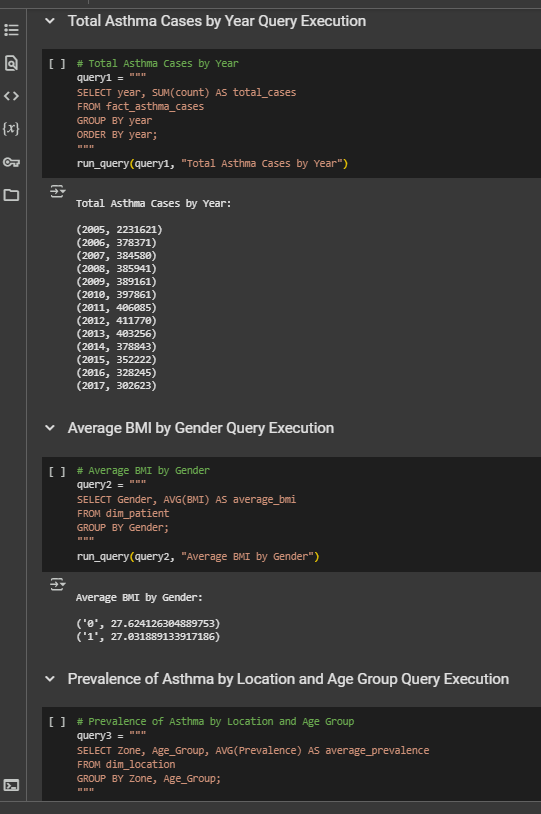
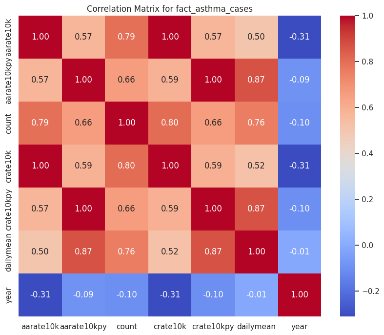
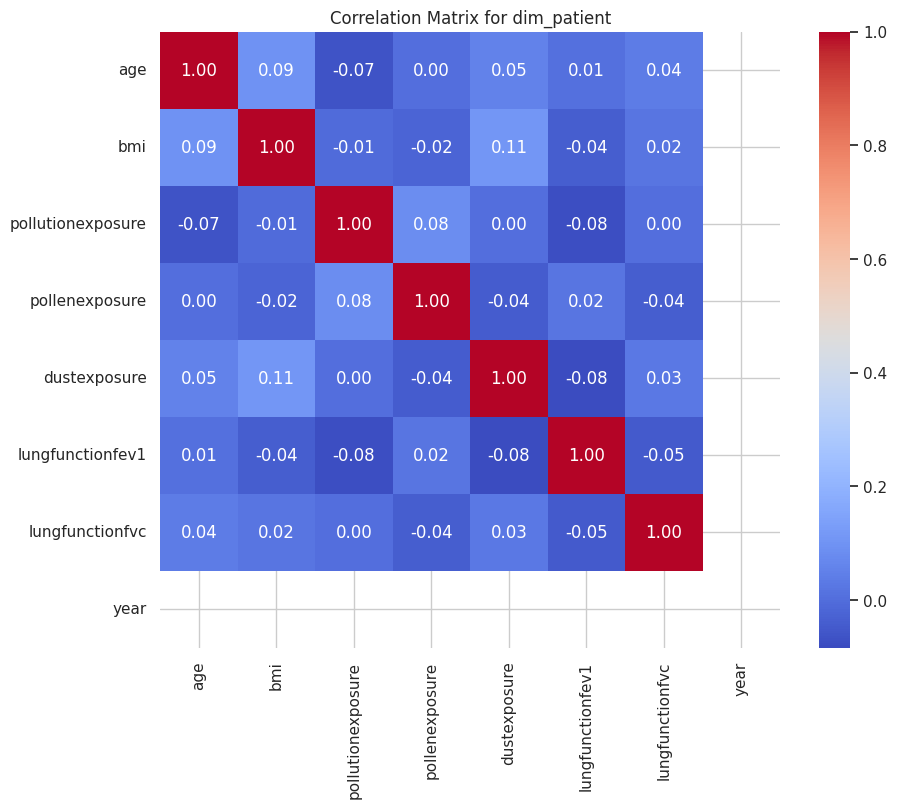
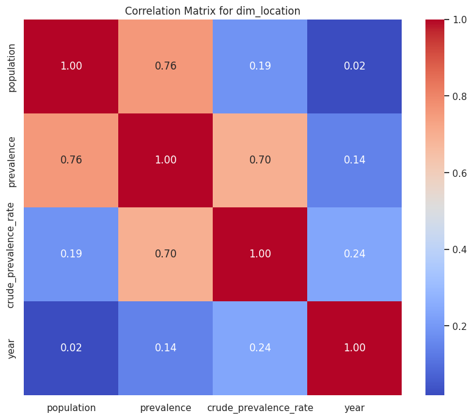
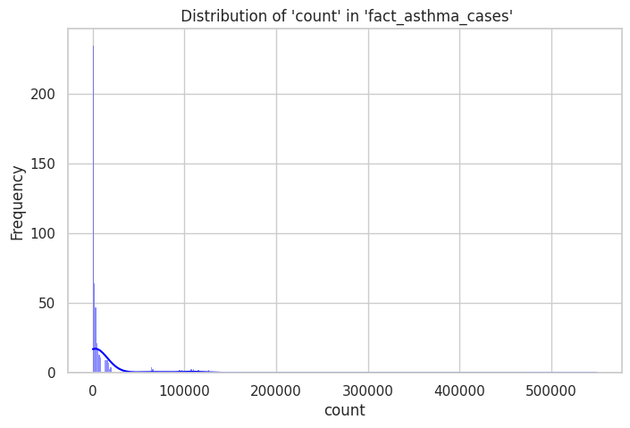
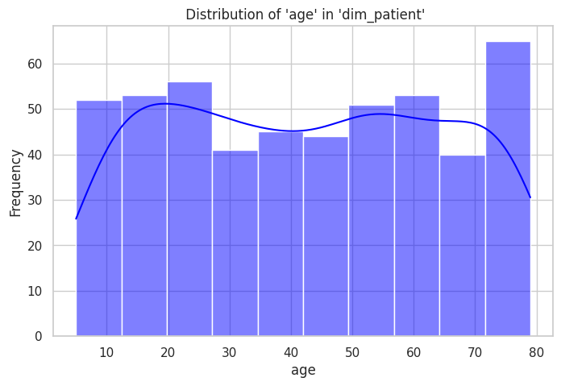
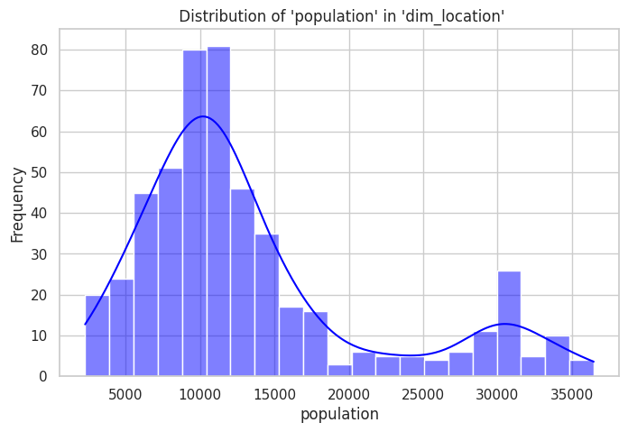

# Asthma Data Analysis with AWS, PostgreSQL (Redshift), and ETL Process

This project involves the extraction, transformation, and loading (ETL) of asthma-related data into Amazon Redshift, followed by data analysis and visualization using Python, Pandas, Matplotlib, and Seaborn. The dataset contains asthma-related data across various locations, patient demographics, and health indicators.

## Table of Contents

- [Overview](#overview)
- [Installation](#installation)
- [AWS Setup](#aws-setup)
- [ETL Process](#etl-process)
- [Data Validation](#data-validation)
- [Data Analysis and Visualization](#data-analysis-and-visualization)
- [Queries and Results](#queries-and-results)

## Overview

This project performs an ETL process on asthma data stored in an AWS S3 bucket. The data is then loaded into Amazon Redshift, where various analyses are performed on the following key dimensions:
- **Fact Table**: `fact_asthma_cases`
- **Patient Dimension**: `dim_patient`
- **Location Dimension**: `dim_location`

The data analysis involves statistical summaries, correlation analysis, and visualizations of the data distributions and categorical features. Analytical queries are executed to derive insights about asthma prevalence, BMI, pollution exposure, and more.

## Installation

To run this project, Need to have Python 3.x installed, along with the following Python packages:

```
!pip install boto3 awscli psycopg2-binary sqlalchemy sqlalchemy-redshift redshift-connector pandas matplotlib seaborn
```
!aws configure

## AWS Setup
## AWS Setup

### AWS S3

The project reads asthma-related data from an S3 bucket named `asthma-data-bucket`. The S3 bucket contains the following CSV files:

- `ny_asthma.csv`
- `global_asthma.csv`
- `canada_asthma.csv`

### AWS Redshift

The transformed data is loaded into an Amazon Redshift database using the Redshift serverless configuration. Ensure have an active Redshift serverless endpoint and replace the credentials in the script.

### AWS Credentials

Set AWS credentials as environment variables for accessing S3 and Redshift:

```python
os.environ['AWS_ACCESS_KEY_ID'] = 'ACCESS_KEY_ID'
os.environ['AWS_SECRET_ACCESS_KEY'] = 'SECRET_ACCESS_KEY'
os.environ['AWS_DEFAULT_REGION'] = 'REGION'
```

### AWS Configuration Screenshot

### Redshift Cluster Status Screenshot

### S3 Bucket Structure Screenshot


## ETL Process

The ETL process involves three main phases:

1. **Extract**: Extract asthma data from the S3 bucket, which contains the following files:
   - `ny_asthma.csv`
   - `global_asthma.csv`
   - `canada_asthma.csv`
   
2. **Transform**: Clean the extracted data, including tasks such as handling missing values, transforming dates, and data standardization.

3. **Load**: Load the transformed data into the Redshift database.

### Data Validation Output Screenshot

### ETL Process Execution Screenshot

### SQL Query Result Screenshot


### Tables Created in Redshift

The following tables are created in Redshift:

- **fact_asthma_cases**: Contains asthma cases data, segmented by year and location.
- **dim_patient**: Stores patient demographic data, such as age, gender, and ethnicity.
- **dim_location**: Contains data about asthma prevalence by location.

## Data Validation

After loading the data into Redshift, the following data validation checks are performed:

- **Row counts for each table**: Ensures that the correct number of rows were loaded into each table.
- **Checking for NULL values**: Ensures there are no missing or NULL values in any of the columns.
- **Checking for duplicate rows**: Ensures there are no duplicate rows in the data.
- **Displaying a few rows for visual inspection**: Displays a sample of the rows to manually inspect for data integrity.

## Data Analysis and Visualization

Various types of analysis are performed on the data:

- **Statistical Analysis**: Provides a summary of the data using `.describe()` to show statistics like mean, median, standard deviation, etc.
- **Correlation Analysis**: A correlation matrix is computed and visualized to identify relationships between numeric features.
- **Visualization of Distributions**: Histograms and KDE plots are used to visualize the distributions of numeric variables.
- **Categorical Data Visualization**: Count plots are used to visualize the counts of categorical variables, such as gender and zone.


## Correlation Matrix for fact_asthma_cases


## Correlation Matrix for dim_patient


## Correlation Matrix for dim_location


## Distribution of Count in fact_asthma_cases


## Distribution of Age in dim_patient


## Distribution of Population in dim_location


## Queries and Results

Here are some example queries executed on Redshift for analytical insights:

- **Total Asthma Cases by Year**: Calculates the total number of asthma cases by year.
- **Average BMI by Gender**: Calculates the average BMI by gender.
- **Prevalence of Asthma by Location and Age Group**: Calculates the average asthma prevalence by location and age group.
- **Average Pollution Exposure by Ethnicity**: Calculates the average pollution exposure by ethnicity.
- **Matching Counties with Zones**: Matches asthma case data from counties with the corresponding zones for more granular analysis.
